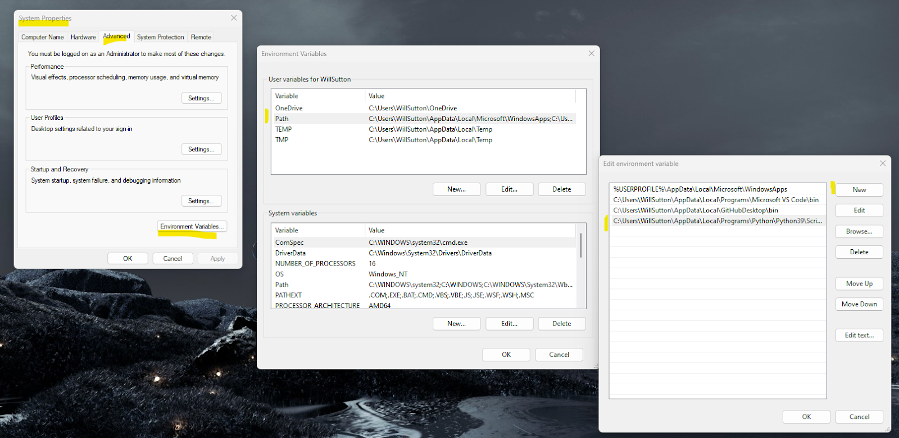
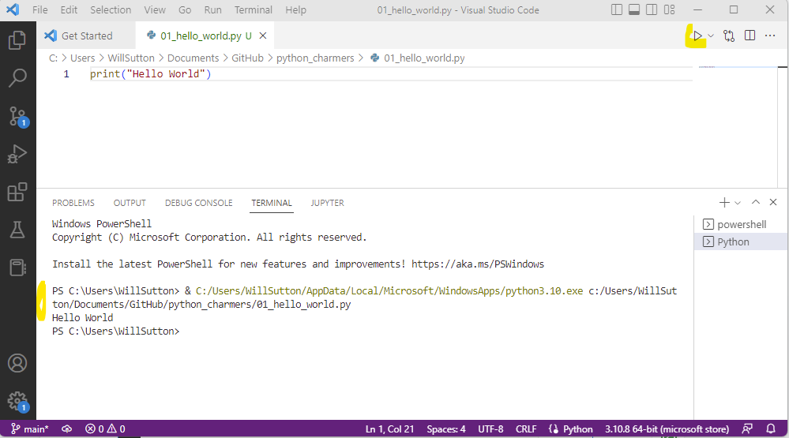

<h1 style="font-weight:normal">
  Python Charmers :snake:
</h1>

Learning python through 15 minute daily projects.

### Day 01: Hello World

Today we’ll be getting you started with python using a text editor called Visual Studio Code. 

**Task: To Download and Install**

- Visual Studio (VS) Code: https://code.visualstudio.com/download
- Python: https://www.python.org/downloads/ 
- Python Visual Studio Code Extension: https://marketplace.visualstudio.com/items?itemName=ms-python.python 


**Task: Check Python is setup in VS Code**

- Open VS Code
- Top Menu  Bar > Select ‘Terminal’ > Select ‘New Terminal’
- In the terminal window type:

```
python –-version
```

This should return “Python “ followed by the version number

If you see an error, it may be likely python is not set as an environment variable. To fix this, you will need to “Edit the system environment variables.”, under the Path variable add the location of your Python install.  



E.g. C:\Users\Username\AppData\Local\Programs\Python\PythonVersion\Scripts

**Task: Execute a Python script**

Next, we’ll make a python script and execute it via the terminal. 

- Open VS Code
- Open a New Text File
- Enter:

```
print("Hello World")
```

This will print to the terminal the words, “Hello World”
Then save your file with a “.py” extension, e.g. `01_hello_world.py`

With your script open in VS Code click the play button in the top right corner.

You should see some text appear in the terminal window:

- In Green: The location of your python install
- After that: The location of your python script
- On the next line: The output of your script

Note: VS Code is writing the longhand version, normally you would see 
`python 01_hello_world.py`

This would work provided your terminal is in the same folder as your python script. You can change folder in the terminal by using the command `cd ` followed by your destination folder. 




